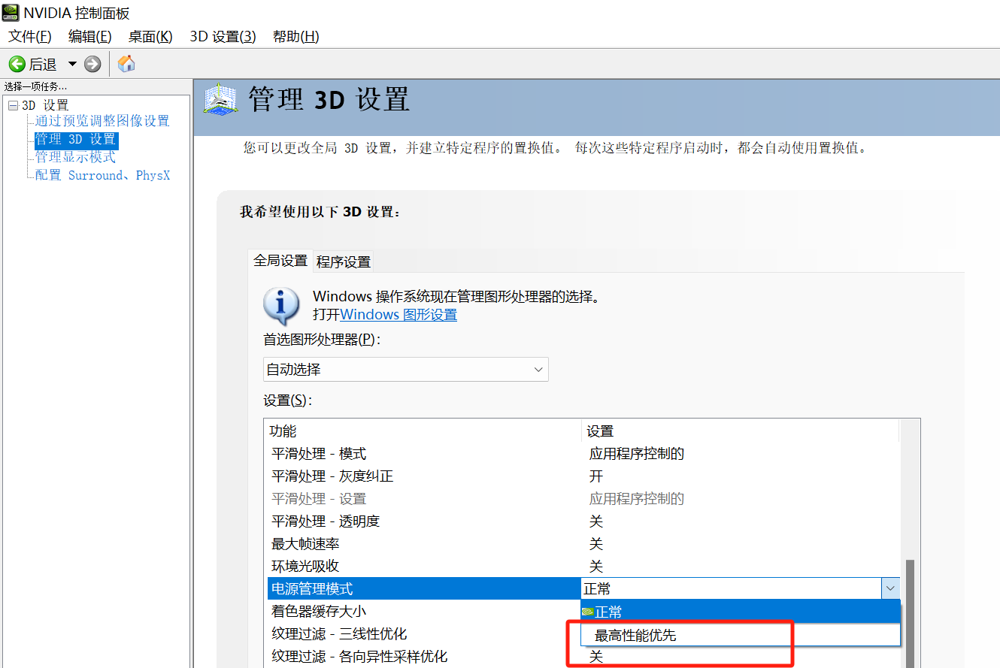

# 云网吧关键信息

## 软硬件环境

### hardware

#### Host: 

**目前中国所有的云网吧显卡都是 NVIDIA + Intel 的方案，AMD 新的计划中明年也有云网吧的规划**

AMD 的稳定性和编解码性能都比 NVIDIA 差， 

#### Client: 

目前主流是用 Intel N5105, Intel N100, AMD 200GE

- Intel N5105 可以双通道， TDP 10W， 比 N100 性能要强， 可以稳定运行在 2K 240fps 下， 目前顺网在使用
- Intel N100 单通道， TDP 6W, 是 Intel 较新的芯片， 目前只有我们的串流方案可以 2K 240fps， 其他的 2K 165fps 都会存在问题，顺网、云更新和云天畅想再用。
- AMD 200GE,  CPU GPU 性能都比较强悍，但是价格高，芯片少，新的串流方案中已经不建议选择了，易乐游再用。

*Minipc bios的节电一定要关掉，否则会有不稳定的现象，最终的表现都是帧率不稳，原因会包含 CPU，GPU 降频，网络丢包或者卡顿*

目前这些minipc都在锁频使用。

### software settings

#### Host

**电源管理，一定要选高性能模式**

**NVIDIA 电源模式选择高性能**

#### Client

电源模式设置高性能

Intel gpu设置为高性能，*如果能拿到 Intel 的锁频驱动更好，可以锁到比bios锁频更高的频率*

*两个系统都要注册掉，避免 windows 水印的影响，越差的配置水印影响越大*

## 测试

软硬件搭建好之后需要测试性能和稳定性

### 网络

串流对网络的要求不高，测试也比较简单，只需要简单的用 fping 测试就可以

<https://github.com/dexit/fping-windows/releases/tag/fping-4-2-win-binary>

`fping -b 1400 -l -p 10 192.168.3.49`, 他这个设置间隔过短会有很多误报，10ms如果有报的话就要排查

### 串流

我们最终要的就是客户机和主机尽可能一样的体验，所以需要着重测试延迟、稳定性和画质。

#### 画质

因为只依赖码率和编码参数，反而不是很重要，测不测都可以，简单的测下像素的颜色偏差就可以。

#### 延迟

延迟影响到用户的操作体验，基本上在云网吧的网络环境下，这个延迟也非常低，用户也比较难感知。简单的测试方案，是通过在主机测放一个毫秒表，然后拍照对比可以得到画面的延迟，总的延迟，再加上键盘鼠标的操作延迟，一般计算为半个rtt
  
#### 稳定

最关键的就是稳定，网络、其他软件都可能会影响到稳定性。

<https://www.geeks3d.com/furmark/>

host端和client端都使用2k 240fps的显示器， host端打开furmark， client端串流上去，每秒记录下 Rtt, capturefps, receivefps, presentfps , 可以另外加一些你们感兴趣的数据

建议同时跑多台记录数据并分析，提取出类似如下数据

| 机器 | 丢帧0-3 | 丢帧4-6 | 丢帧10-15 | 丢帧20+ | 平均丢帧 | Capture fps | Receive fps |
| ---- | ---- | ---- | ---- | ---- | ---- | ---- | ---- |
| 第一组 |  |  |  |  |  |  |  |
| 第二组 |  |  |  |  |  |  |  |
| 第三组 |  |  |  |  |  |  |  |

丢帧较多时，需要对比rtt信息， 如果rtt正常， 需要加调试软件

## 上线运营

所有测试没问题后，需要进入网吧实测，需要收集网吧中运行的数据，特别是连接失败率，连接成功后的各种fps和rtt，有问题可以及时发现和分析修复。
  
### 平台

需要有平台可以随时查看运行过程，必须包括的有

host端、client端开机时间，软硬件信息，ip等能区分的信息，串流过程(开始时间、关闭时间)

host端需要有keepalive信息，可以在host端意外关机、蓝屏、断网等情况下，平台可以收到消息

*实际运行中可能会有各种问题，平台也需要不断完善*

### 虚拟显示器

如果客户端是确定的网吧，尽量不要用 Deeplink 自带的虚拟显示器，这个是为兼容性做了牺牲，会影响到host测的游戏帧率，建议使用我们提供的另外的方案。

[Internet cafe virtual display deployment scheme](./internet_cafe_virtual_display_deployment_scheme.md)

*虚拟显示器创建需要时间，不同的 GPU 和驱动版本时间会不一样，尽量在开机的时候创建完毕*
