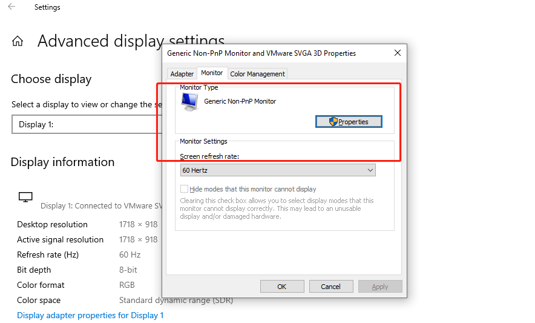

# Internet cafe virtual display deployment scheme

there are many types of monitors in Internet cafes, there are a large number of monitors with non-standard resolutions and refresh rates, so the virtual monitor solution needs to be deployed before going online

*If the controlled end is not connected to the monitor, the windows mode will copy the client's monitor to the host by default, but android, ios, etc. cannot obtain the edid, and the following rules will be used。*

## 1, Get edid from the monitor in internet cafeet

Download edidmanager from

<https://www.extron.com/product/software/edidmanager21>

<https://www.entechtaiwan.com/util/moninfo.shtm>

Find the correct monitor, and file-->save as,  get the edid file

If there are multiple monitors, refer to the monitor settings of windows, as shown in the figure below

Or use getedid.exe to get edid

## 2、Configure the virtual display scheme on the host

Open Deeplink Vdisplay Config file in host

If the edid you just get is 2560*1600*120fps

Can rename edid file to 2560x1600x120.hex and put this file in `C:\Program Files (x86)\DeepLink\edid\`

## 3、test

Remove all monitor in server and reboot, and then use deeplink in client pc to connect the server,  
the monitor of the server will become 2560x1600x120
